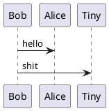

# Tools **doxygen** **sphinx** **plantuml** **C**
## *doxygen*
    1: install doxygen and Graphviz  
    2: install miktex 
    3: generate doxygen config file by doxywizard  
        3.1: or doxygen -g generate a doxygen config template **doxygen -g <config-file>**
        3.2 doxywizard is much more easy to check the setting
    4: generate document  **doxygen <config-file>**   
    5: in terminal doxygen configfile  
## *sphinx*  
    1: install sphinx  
    2: install miktex  
    3: install perl(Strawberry perl)  
    4: in terminal **sphinx-build**
    5: in terminal "make latexpdf" or "make html" 
    6: in terminal "mingw32-make latexpdf" or "mingw32-make html"  
## *plantuml* in vscode
    1: install "Markdown All In One"
    2: install "Markdown Preview Enhanced"
    3: set preview theme to dark
        3.1: ctrl+shift+V to preview
    4:*.puml alt+d to preview plantuml
## *C* in VScode
    1: install MSYS2 https://www.msys2.org/
    2: **pacman -S --needed base-devel mingw-w64-x86_64-toolchain**



```C
#include "stdio.h"
main()
{
 printf("hellow\n");
}
```
```math
    R = R0 * (1 + alpha * (T - T0))
```
$R = R0 * (1 + alpha * (T - T0))$


